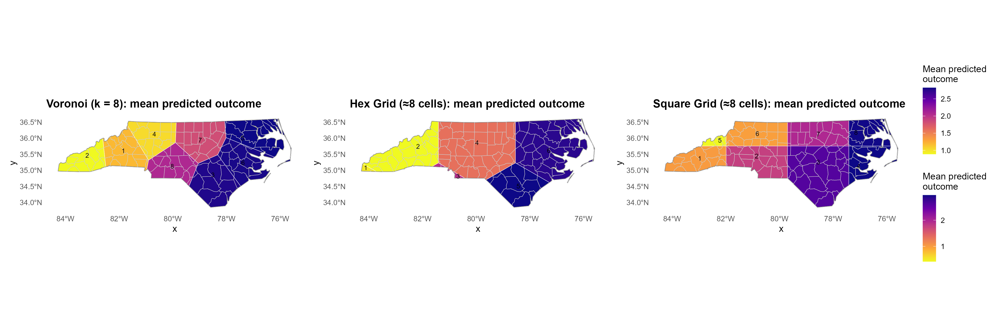

# GIS Modeling Toolkit (`gis_modeling_toolkit.R`)

Data-driven spatial partitioning for R: build Voronoi/hex/square tessellations, assign features to cells, and compare models (GWR & Bayesian) to pick the best number of groups—without being locked to arbitrary admin boundaries.

---

## Why
Real-world phenomena (weather, demand, risk) don’t stop at county or ZIP borders. This toolkit lets you **derive boundaries from the data itself** and evaluate which partitioning best explains your outcomes.

---

## What it does
- **CRS-safe preprocessing**: auto-detects lon/lat, picks a sensible projected CRS, and harmonizes layers.
- **Pointization**: converts lines/polygons to representative points for clustering/assignment.
- **Tessellations**: Voronoi (k-means/random/provided seeds), hex grids, and square grids—optionally clipped to a boundary.
- **Assignment**: maps features to polygons and returns per-cell groupings.
- **Level selection**: suggests good cluster counts via an elbow heuristic on within-cluster SSE.
- **Modeling**: fits GWR (`spgwr`) and Bayesian spatial models (`spBayes`) and scores them (AICc/DIC).
- **Plotting**: clean maps with polygon ID labels (or counts) over optional basemaps/boundaries.

---

## Requirements
- R (≥ 4.2 recommended)
- Packages: `logger`, `sf`, `sp`, `spgwr`, `spBayes`, `deldir`, `ggplot2`, `dplyr`, `tidyr`, `mvtnorm`
- Optional: `ggspatial` (OSM tiles), `patchwork` (multi-panel figure)

Install in R:
    
    install.packages(c(
      "logger","sf","sp","spgwr","spBayes","deldir",
      "ggplot2","dplyr","tidyr","mvtnorm","ggspatial","patchwork"
    ))

---

## Quick start

1) **Source the toolkit**

    source("R/gis_modeling_toolkit.R")

2) **Make or load points** (use your own data; here’s a simple demo)

    library(sf); library(dplyr)
    set.seed(42)
    bb <- sf::st_as_sfc(sf::st_bbox(c(xmin=-80, ymin=35, xmax=-79, ymax=36), crs=4326))
    pts <- sf::st_sample(bb, size = 300, type = "random", exact = TRUE) |> sf::st_sf()
    pts <- ensure_projected(pts)  # choose a sensible projected CRS

3) **Build tessellations** (k = 8 shown; use any of: "voronoi","hex","square")

    bt_v <- build_tessellation(pts, levels = 8, method = "voronoi", seeds = "kmeans")
    bt_h <- build_tessellation(pts, levels = 8, method = "hex")
    bt_s <- build_tessellation(pts, levels = 8, method = "square")

4) **Plot** (labels display polygon IDs)

    p_v <- plot_tessellation_map(bt_v[["8"]]$polygons, bt_v[["8"]]$data,
                                 title = "Voronoi (k=8)", label = "poly_id")
    p_h <- plot_tessellation_map(bt_h[["8"]]$polygons, bt_h[["8"]]$data,
                                 title = "Hex (≈8 cells)", label = "poly_id")
    p_s <- plot_tessellation_map(bt_s[["8"]]$polygons, bt_s[["8"]]$data,
                                 title = "Square (≈8 cells)", label = "poly_id")

    ggplot2::ggsave("voronoi_k8.png", p_v, width=8, height=6, dpi=200)

---

## Overlay on a shapefile (North Carolina example)

    library(sf)
    nc <- sf::st_read(system.file("shape/nc.shp", package = "sf"), quiet = TRUE)
    nc_boundary <- sf::st_union(nc)

    # Align CRSs
    pts <- ensure_projected(pts, nc_boundary)
    nc_boundary <- ensure_projected(nc_boundary)
    nc <- sf::st_transform(nc, sf::st_crs(nc_boundary))

    # Build tessellations clipped to the state
    k <- 8
    bt_v <- build_tessellation(pts, levels = k, method = "voronoi",
                               boundary = nc_boundary, seeds = "kmeans")
    # Plot with counties as a basemap and boundary outline
    p_v <- plot_tessellation_map(bt_v[[as.character(k)]]$polygons,
                                 bt_v[[as.character(k)]]$data,
                                 title = sprintf("North Carolina — Voronoi (k=%d)", k),
                                 boundary = nc_boundary, basemap = nc, label = "poly_id")

---

## Pick the number of groups & best model

    # Suggest cluster counts from data
    k_suggest <- determine_optimal_levels(pts, max_levels = 12, top_n = 3)

    # Suppose you have a response + predictors on the same sf (add your columns to pts)
    # pts$resp <- ...
    # pts$x1 <- ...; pts$x2 <- ...
    res <- evaluate_models(
      data_sf       = pts,                 # must contain columns resp & predictors
      response_var  = "resp",
      predictor_vars= c("x1","x2"),
      levels        = k_suggest,           # or set explicitly, e.g., c(6,8,10)
      tessellation  = c("voronoi","hex","square"),
      boundary      = NULL,                # or a polygon sf to clip
      seeds         = "kmeans",
      models        = c("GWR","Bayesian"),
      n.samples     = 2000,
      cov_model     = "exponential"
    )

    # Results tibble: Tessellation, Level, Model, Metric (AICc for GWR, DIC proxy for Bayesian)
    dplyr::arrange(res$results, Metric)

---

## Make a single figure with all three maps (white background)

    library(patchwork)
    combo <- p_v + p_h + p_s + patchwork::plot_layout(ncol = 3) &
             ggplot2::theme(plot.background = ggplot2::element_rect(fill = "white", color = NA))
    ggplot2::ggsave("tessellations_side_by_side.png", combo, width = 18, height = 6, dpi = 200, bg = "white")

---

## Function index (brief)

- **`ensure_projected(x, target_crs=NULL)`** — ensures a projected CRS; can force to match a target CRS.
- **`harmonize_crs(a, b)`** — aligns CRS between two sf/sfc objects (returns list `a`, `b`).
- **`coerce_to_points(x, strategy)`** — representative points from any geometry (auto/surface/centroid/line_midpoint).
- **`create_voronoi_polygons(points, clip_with=NULL)`** — Voronoi polygons from seed points; optional clipping.
- **`create_grid_polygons(boundary, target_cells, type)`** — hex/square grids clipped to a boundary.
- **`voronoi_seeds_kmeans(points_sf, k)`** — k-means cluster centers as Voronoi seeds.
- **`voronoi_seeds_random(boundary, k)`** — k random seeds inside a boundary.
- **`assign_features_to_polygons(features, polygons)`** — intersects features with tessellation; adds `polygon_id`.
- **`determine_optimal_levels(points_sf, max_levels, top_n)`** — elbow heuristic over k-means WSS.
- **`fit_gwr_model(data_sf, response, predictors)`** — fits GWR; returns model, bandwidth, AICc.
- **`fit_bayesian_spatial_model(data_sf, response, predictors, n.samples, cov_model)`** — fits Bayesian spatial model; returns samples & DIC proxy.
- **`build_tessellation(features_sf, levels, method, boundary, seeds, ...)`** — constructs tessellation(s) and assignments per level.
- **`evaluate_models(...)`** — builds tessellations, fits models across levels/methods; returns a results tibble.
- **`plot_tessellation_map(polygons, points, ..., label=c("poly_id","count","none"))`** — clean map with labels; optional basemap/boundary.
- **`summarize_by_cell(assigned_points_sf, response, predictors)`** — per-cell counts and means.

---

## UAT
A full UAT script lives at `UAT/run_uat_spatial_modeling.R`.  
If you rename the toolkit file, update:

- `script_path <- file.path(script_dir, "gis_modeling_toolkit.R")`

Then run the UAT to verify CRS handling, tessellations, assignments, modeling, and plotting.

---

## Tips & troubleshooting
- **Missing CRS**: set or infer CRS first; `ensure_projected()` assigns WGS84 if bbox looks like lon/lat, then projects.
- **Label choice**: set `label = "poly_id"` (IDs) or `label = "count"` (point counts). Use `label="none"` to hide.
- **OSM tiles**: set `use_osm_tiles=TRUE` (requires `ggspatial`); all layers are drawn in EPSG:3857.
- **Non-point input**: `coerce_to_points()` handles lines/polygons (on-surface/centroids/line midpoints).

---

## Current limitations & scaling roadmap

**Where it works well today**
- Interactive to moderate workloads (thousands to low tens of thousands of features), single-machine R.
- Rapid prototyping of Voronoi/hex/square partitions, assignment, and model comparison (GWR AICc / Bayesian DIC proxy).

**Known limitations**
- **No built-in cross-validation yet.** Metrics are in-sample; boundary choices and bandwidths aren’t validated out-of-fold.
- **Scaling pressure at large n (≈50k+).**  
  - GWR (`spgwr`) uses dense distance operations and slows markedly with many repeats.  
  - Bayesian GP (`spBayes::spLM`) has \(O(n^3)\) tendencies; memory/time grow quickly.
- **Voronoi at high k** can be slow/heavy; numeric quirks at duplicate/near-duplicate seeds require jittering.
- **Spatial joins** (`st_intersects/within`) become a bottleneck without careful projection/prepared geometries.
- **CRS/geometry edge cases.** S2 vs planar behavior, invalid polygons, and mixed geometry collections can require extra handling.
- **Reproducibility.** Seeding (k-means/random) is RNG-dependent; tessellation IDs and maps can shift without fixed seeds.
- **Plotting/tiles.** OSM basemaps require `ggspatial` and EPSG:3857 reprojection; offline runs skip tiles.

**Cross-validation at scale (in progress)**  
I’m upgrading the toolkit to support **spatially aware CV** without leakage, but it’s more complex than expected. The work includes:
- Fold generators: random K-fold and **spatial block/grid splits** with optional **buffer gaps** (to avoid train–test bleed).
- **Fold-aware tessellations:** seeds derived **only from train data**, polygons built/clipped once per fold, and **stable `poly_id` mapping** for scoring/plots.
- **Scaled model backends:**  
  - GWR with k-NN neighborhoods (RANN/FNN) as a fast alternative to `spgwr` for big-n.  
  - **NNGP** backends (`spNNGP`) as a scalable replacement for full GP when \(n\) is large.
- **Faster seeding:** mini-batch k-means for Voronoi seeds and WSS estimation in elbow heuristics.
- **Caching & reuse:** prepared/unioned boundaries, clipped grids, and compiled spatial indexes reused across folds.
- **Metric aggregation:** out-of-fold AICc-like scores for GWR, WAIC/DIC-like proxies for Bayesian, plus RMSE/MAE.

**Why it’s non-trivial**
- Avoiding **information leakage** (train-only seeding + assignment) while keeping polygons comparable across folds.
- Maintaining **deterministic, stable tessellation IDs** for fold-by-fold evaluation and visualization.
- Balancing **projection/geometry validity** and performance (S2 vs planar) across repeated operations.
- Managing **memory and runtime** for big-n under repeated model fits.

**What you can do now**
- Use hex/square grids for very large n; keep Voronoi k moderate.  
- Fix seeds (`set.seed(...)`) for reproducible tessellations.  
- Ensure inputs are **projected** (use `ensure_projected()`), and prefer **prepared/unioned boundaries**.  
- For Bayesian runs, start with fewer MCMC samples and the **exponential** covariance for speed.  
- Sample points to estimate the elbow (`determine_optimal_levels`) when n is very large.
