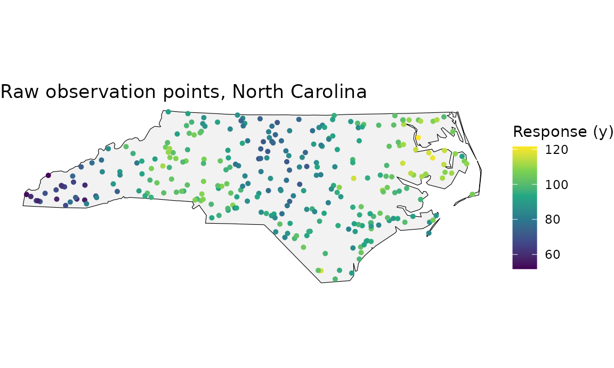
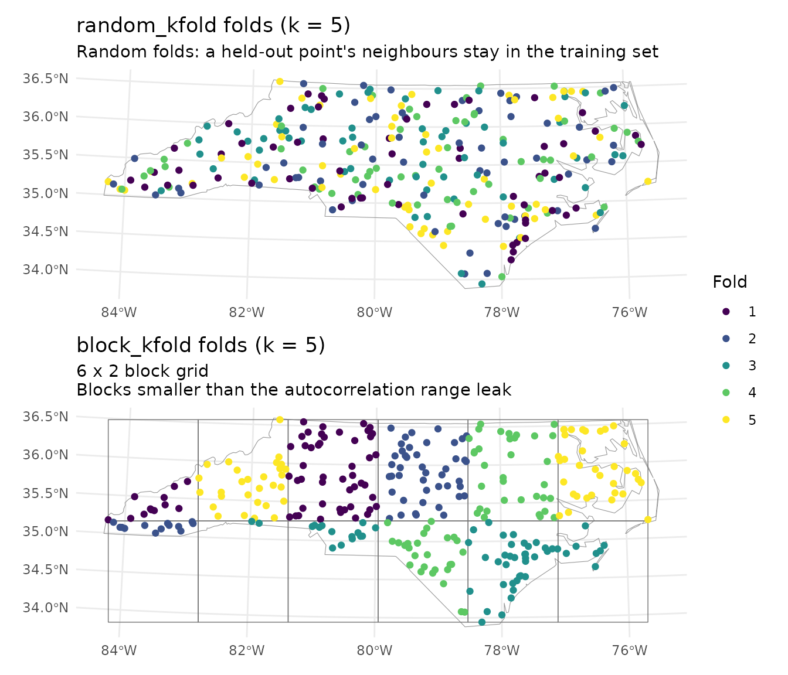
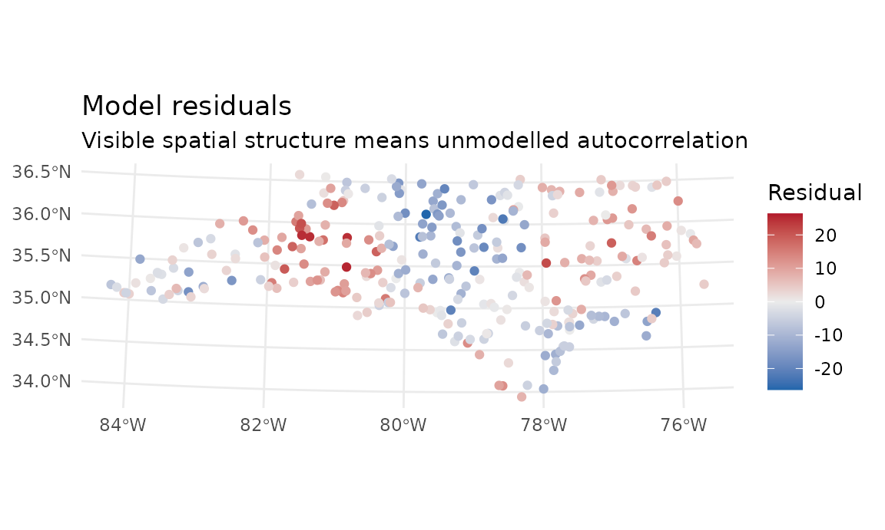
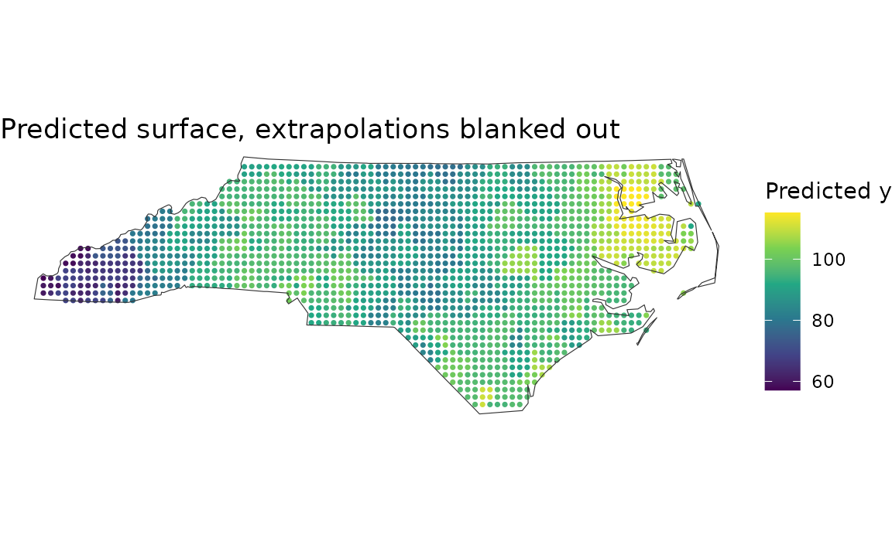

# spatialkit: Tessellations, Spatial Cross-Validation and Models

## Overview

This vignette generates **synthetic spatial data** over North Carolina
and walks through the `spatialkit` workflow end to end:

1.  Build four tessellation types (Voronoi, hex, square, Delaunay)
2.  Assign points to cells and aggregate with
    [`summarize_by_cell()`](https://elkronos.github.io/gis_modeling_toolkit/reference/summarize_by_cell.md)
3.  Draw choropleths of the cell-level mean response
4.  Estimate the autocorrelation range and build spatial CV folds
5.  Fit a model, and score it under **blocked** versus **random** folds
6.  Predict onto a surface and mark where that surface is extrapolation

Everything is self-contained — the boundary comes from the `nc.shp` demo
shapefile bundled with `sf`, so no external files are needed.

Optional backends are checked at the top and every section that needs
one is guarded, so this document renders with whatever you happen to
have installed. This table always runs, even when the gate below it is
shut – it is what says which backend is missing when the code stops
producing output:

    ##        package available                          used_for
    ## 1      ggplot2      TRUE                         all plots
    ## 2     geometry      TRUE       true Delaunay triangulation
    ## 3       ranger      TRUE             random forest backend
    ## 4        gstat      TRUE variogram / autocorrelation range
    ## 5 GWmodel + sp      TRUE                       GWR backend

------------------------------------------------------------------------

## 1. Packages and boundary

``` r

library(spatialkit)
library(sf)
library(dplyr)
library(ggplot2)

set.seed(42)
```

We load the North Carolina county boundaries shipped with `sf`, dissolve
them into a single state outline, and project to **NAD83 / North
Carolina (ftUS)** (EPSG:2264) so distances are planar rather than
angular. Every distance, bandwidth and block size below is therefore in
**US survey feet**, not metres — projected does not mean metric, and the
unit is whatever the CRS says it is:

``` r

nc_counties <- st_read(system.file("shape/nc.shp", package = "sf"), quiet = TRUE)
nc_boundary <- nc_counties |>
  st_union() |>
  st_transform(2264) |>
  st_as_sf()
```

------------------------------------------------------------------------

## 2. Synthetic observations

300 points inside the state boundary with two predictors and a spatially
varying response:

- `elevation` — gradient increasing west to east, plus noise
- `pop_density` — decays with distance from two fake “cities”
- `y` — driven by the two predictors **plus a spatial field neither of
  them explains**. That last term is deliberate: it is the unmodelled
  spatial structure that makes random cross-validation optimistic, and
  it is what section 5 measures.

``` r

n_points <- 300

pts_raw    <- st_sample(nc_boundary, size = n_points, type = "random")
pts_coords <- st_coordinates(pts_raw)
x_coords   <- pts_coords[, 1]
y_coords   <- pts_coords[, 2]

elevation <- scale(x_coords)[, 1] * 500 + rnorm(n_points, 3000, 400)

city1 <- c(1530000, 550000)   # Charlotte-ish in EPSG:2264
city2 <- c(2150000, 750000)   # Raleigh-ish
dist_to_city <- pmin(
  sqrt((x_coords - city1[1])^2 + (y_coords - city1[2])^2),
  sqrt((x_coords - city2[1])^2 + (y_coords - city2[2])^2)
)
pop_density <- pmax(exp(-dist_to_city / 400000) * 5000 + rnorm(n_points, 200, 100), 10)

spatial_field <- 20 * sin(x_coords / 250000) * cos(y_coords / 250000)

y_response <- 50 +
  0.01  * elevation +
  0.005 * pop_density +
  spatial_field +
  rnorm(n_points, 0, 5)

points_sf <- st_sf(
  y           = y_response,
  elevation   = elevation,
  pop_density = pop_density,
  geometry    = pts_raw
)
```

``` r

ggplot() +
  geom_sf(data = nc_boundary, fill = "grey95", colour = "black") +
  geom_sf(data = points_sf, aes(colour = y), size = 1.1) +
  scale_colour_viridis_c(name = "Response (y)") +
  theme_void() +
  ggtitle("Raw observation points, North Carolina")
```



------------------------------------------------------------------------

## 3. Four tessellations

### 3a. Voronoi from ~40 k-means seeds

Voronoi cells are built around *seed* points, not the observations
themselves. Seeding one cell per observation would give 300 cells each
containing a single point — a nearest-neighbour interpolation rather
than an aggregation, with no within-cell variation to compute a standard
error from.
[`get_voronoi_seeds()`](https://elkronos.github.io/gis_modeling_toolkit/reference/get_voronoi_seeds.md)
clusters the observations first, so cell size follows sampling density.

``` r

seeds <- get_voronoi_seeds(
  boundary      = nc_boundary,
  sample_points = points_sf,
  method        = "kmeans",
  n             = 40
)

tess_voronoi <- build_tessellation(
  seeds, boundary = nc_boundary,
  method = "voronoi", clip = TRUE, quiet = TRUE
)
```

### 3b and 3c. Hex and square grids (~50 cells)

``` r

tess_hex <- build_tessellation(
  points_sf, boundary = nc_boundary,
  method = "hex", approx_n_cells = 50, clip = TRUE, quiet = TRUE
)

tess_square <- build_tessellation(
  points_sf, boundary = nc_boundary,
  method = "square", approx_n_cells = 50, clip = TRUE, quiet = TRUE
)
```

All four methods return cells carrying a `cell_id` column; the grid
methods keep `poly_id` alongside it, holding the same values.

``` r

names(tess_hex$cells)
```

    ## [1] "poly_id"  "geometry" "cell_id"

### 3d. Delaunay triangles

`method = "triangles"` uses
[`geometry::delaunayn()`](https://rdrr.io/pkg/geometry/man/delaunayn.html)
when `geometry` is installed. Without it, it does **not** error — it
falls back to
[`sf::st_triangulate()`](https://r-spatial.github.io/sf/reference/geos_unary.html)
(GEOS) on the point set and logs a warning. That is still the Delaunay
triangulation of the input points; only the resolution of degenerate
configurations can differ. Because the two paths are not identical, this
section is guarded on `geometry` rather than on the call succeeding:

``` r

tess_tri <- build_tessellation(
  points_sf, boundary = nc_boundary,
  method = "triangles", clip = TRUE, quiet = TRUE
)
nrow(tess_tri$cells)
```

    ## [1] 586

``` r

cat(sprintf(
  "Voronoi: %d | Hex: %d | Square: %d | Triangles: %s\n",
  nrow(tess_voronoi$cells),
  nrow(tess_hex$cells),
  nrow(tess_square$cells),
  if (has_geom) nrow(tess_tri$cells) else "skipped (install 'geometry')"
))
```

    ## Voronoi: 40 | Hex: 49 | Square: 45 | Triangles: 586

------------------------------------------------------------------------

## 4. Cell-level aggregation with `summarize_by_cell()`

[`assign_features_to_polygons()`](https://elkronos.github.io/gis_modeling_toolkit/reference/assign_features_to_polygons.md)
joins points to cells;
[`summarize_by_cell()`](https://elkronos.github.io/gis_modeling_toolkit/reference/summarize_by_cell.md)
does the aggregation — means, standard deviations and standard errors
for the response and every predictor, plus `n` and `cell_weight`. There
is no need to write the
[`group_by()`](https://dplyr.tidyverse.org/reference/group_by.html)/[`summarise()`](https://dplyr.tidyverse.org/reference/summarise.html)
by hand, and doing so loses the design-effect machinery below.

``` r

assigned <- assign_features_to_polygons(points_sf, tess_voronoi$cells,
                                        polygon_id_col = "cell_id")

cell_stats <- summarize_by_cell(
  assigned,
  response_var   = "y",
  predictor_vars = c("elevation", "pop_density"),
  id_col         = "cell_id"
)

head(as.data.frame(cell_stats)[, c("cell_id", "n", "resp_mean_y",
                                   "..sd_resp_y", "..se_resp_y")])
```

    ##   cell_id n resp_mean_y ..sd_resp_y ..se_resp_y
    ## 1       1 6    62.89141    7.074136    2.888004
    ## 2       2 7    63.36230    7.516155    2.840840
    ## 3       3 5    67.11282    8.521317    3.810849
    ## 4       4 5    70.34951   12.427812    5.557886
    ## 5       5 5    79.61205    5.327447    2.382507
    ## 6       6 4    84.14516    7.886035    3.943018

The `..se_*` columns are **IID** standard errors at the default
`deff = 1`, which is anticonservative when points inside a cell are
spatially correlated. `deff = "kish"` applies Kish’s design-effect
correction from an estimated intra-class correlation, and
`attr(., "deff_applied")` records what was used:

``` r

cell_kish <- summarize_by_cell(
  assigned,
  response_var   = "y",
  predictor_vars = c("elevation", "pop_density"),
  id_col         = "cell_id",
  deff           = "kish"
)

deff <- attr(cell_kish, "deff_applied")
cat(sprintf("method = %s | ICC(response) = %.3f | median design effect = %.2f\n",
            deff$method, deff$icc_resp, stats::median(deff$deff, na.rm = TRUE)))
```

    ## method = kish | ICC(response) = 0.742 | median design effect = 5.45

``` r

# Inflation of the response standard error, cell by cell.
summary(cell_kish$`..se_resp_y` / cell_stats$`..se_resp_y`)
```

    ##    Min. 1st Qu.  Median    Mean 3rd Qu.    Max. 
    ##   3.535   4.271   4.595   4.705   5.183   6.193

### Choropleths

``` r

#' Assign points to cells, summarise, and draw a choropleth.
make_choropleth <- function(tess, boundary, points, title = NULL) {
  cells    <- tess$cells
  assigned <- assign_features_to_polygons(points, cells, polygon_id_col = "cell_id")

  stats_df <- summarize_by_cell(assigned, response_var = "y",
                                id_col = "cell_id")
  cells    <- left_join(cells, as.data.frame(stats_df)[, c("cell_id", "resp_mean_y")],
                        by = "cell_id")

  plot_tessellation_map(
    tessellation_sf = cells,
    boundary        = boundary,
    fill_col        = "resp_mean_y",
    palette         = "viridis",
    tile_alpha      = 0.9,
    outline_col     = "white",
    outline_size    = 0.3,
    boundary_col    = "grey20",
    boundary_size   = 0.8,
    legend_title    = "Mean y",
    title           = title,
    subtitle        = sprintf("%d cells | %d observations",
                              nrow(cells), nrow(points))
  )
}
```

``` r

make_choropleth(tess_voronoi, nc_boundary, points_sf, "Voronoi tessellation")
```


Voronoi choropleth

``` r

make_choropleth(tess_hex, nc_boundary, points_sf, "Hexagonal grid")
```


Hex grid choropleth

``` r

make_choropleth(tess_square, nc_boundary, points_sf, "Square grid")
```


Square grid choropleth

``` r

make_choropleth(tess_tri, nc_boundary, points_sf, "Delaunay triangulation")
```


Delaunay choropleth

The three stacked on one shared colour scale. Each map drawn on its own
gets its own scale, so a colour in one means a different value in the
next; here the limits are set from all three together and `patchwork`
then collects the legends into one, which is what makes reading down the
page legitimate.

``` r

library(patchwork)

# The cell means of all three, so the colour scale can span them.
cell_means <- function(tess) {
  a <- assign_features_to_polygons(points_sf, tess$cells, polygon_id_col = "cell_id")
  summarize_by_cell(a, response_var = "y", id_col = "cell_id")$resp_mean_y
}
lims <- range(unlist(lapply(list(tess_voronoi, tess_hex, tess_square), cell_means)),
              na.rm = TRUE)

# One line per map instead of a title and a subtitle, and the cell count taken
# from the tessellation rather than typed in.
bare <- function(tess, label) {
  make_choropleth(tess, nc_boundary, points_sf) +
    ggplot2::scale_fill_viridis_c(name = "Mean y", limits = lims) +
    ggplot2::labs(title = sprintf("%s, %d cells", label, nrow(tess$cells)),
                  subtitle = NULL) +
    ggplot2::theme(plot.title = ggplot2::element_text(size = ggplot2::rel(1)))
}

(bare(tess_voronoi, "Voronoi") /
 bare(tess_hex,     "Hex") /
 bare(tess_square,  "Square")) +
  plot_layout(guides = "collect") +
  plot_annotation(title = "Tessellation comparison, cell-level mean response")
```


All three at a glance

------------------------------------------------------------------------

## 5. Spatial cross-validation

This is the part the rest of the package exists to support.

### 5a. How far does correlation reach?

[`estimate_sac_range()`](https://elkronos.github.io/gis_modeling_toolkit/reference/estimate_sac_range.md)
fits an omnidirectional variogram and returns the effective range in CRS
units — here, US survey feet. It also fits the four principal directions
and reports their ranges in the `directional` attribute (with their
largest-over-smallest ratio in `anisotropy`), but only as a diagnostic:
each direction sees about a quarter of the point pairs, the maximum of
four such fits is biased upward, and the windows are fixed to the
coordinate axes, so nothing built from them is invariant to rotating the
layer. The all-pairs fit is the estimate whenever it is usable; the
directional maximum stands in for it only when the all-pairs fit fails,
and the `anisotropy_used` attribute is `TRUE` in that case alone. If you
*know* the field is anisotropic, size blocks from
`max(attr(sac, "directional"))` explicitly. It returns `NA` (still
classed `sac_range`, so it prints as a bare `NA`) when the empirical
variogram never reaches a sill, because an unidentified range must not
be used to size blocks.

``` r

sac <- estimate_sac_range(points_sf, response_var = "y",
                          predictor_vars = c("elevation", "pop_density"))
sac
```

    ## NA 
    ##   directional: 0 deg = 22475325 (past the fitted lags), 45 deg = 1243020, 90 deg = 1591410 (past the fitted lags), 135 deg = 3346918 (past the fitted lags)

``` r

if (is.na(sac)) {
  cat("no identified range:", attr(sac, "rejected_reason"), "\n")
} else {
  cat(sprintf("range = %.0f ft; anisotropy ratio %.2f; used %s\n",
              as.numeric(sac), attr(sac, "anisotropy"),
              attr(sac, "anisotropy_used")))
}
```

    ## no identified range: fitted range exceeds the largest lag fitted

The fit is attached either way, so `plot(fit, type = "variogram")` on a
fitted model can draw the curve and let you judge it rather than trust
it — the distance axis is labelled in the units of the CRS the variogram
was fitted in, and a fit that did not converge says so in the caption. A
rejected range must not be handed to `make_folds(auto_range = TRUE)`,
which is why it comes back `NA` rather than as a long range.

### 5b. Two fold schemes on the same data

``` r

folds_random  <- make_folds(points_sf, k = 5, method = "random_kfold", seed = 42)
folds_blocked <- make_folds(points_sf, k = 5, method = "block_kfold",  seed = 42)

c(random = folds_random$k, blocked = folds_blocked$k)
```

    ##  random blocked 
    ##       5       5

[`plot_folds()`](https://elkronos.github.io/gis_modeling_toolkit/reference/plot_folds.md)
is the fastest way to see whether the blocks actually separate the data
or are smaller than the autocorrelation range and therefore leaking:

``` r

library(patchwork)
(plot_folds(folds_random,  points_sf, boundary = nc_boundary) /
 plot_folds(folds_blocked, points_sf, boundary = nc_boundary)) +
  plot_layout(guides = "collect")
```



### 5c. The number the fold scheme changes

[`fit_rf_model()`](https://elkronos.github.io/gis_modeling_toolkit/reference/fit_rf_model.md)
and
[`cv_rf()`](https://elkronos.github.io/gis_modeling_toolkit/reference/cv_rf.md)
need `ranger`. `include_coords = TRUE` hands the forest the coordinates,
which lets it memorise the training surface — the failure mode the
default (`FALSE`) exists to prevent, and the one random folds cannot
see. Scoring the same model on both fold schemes shows the size of the
gap:

``` r

rf_args <- list(include_coords = TRUE, num_trees = 300, seed = 1)

cv_random  <- do.call(cv_rf, c(list(points_sf, "y", c("elevation", "pop_density"),
                                    folds = folds_random),  rf_args))
cv_blocked <- do.call(cv_rf, c(list(points_sf, "y", c("elevation", "pop_density"),
                                    folds = folds_blocked), rf_args))

data.frame(
  folds = c("random_kfold", "block_kfold"),
  R2    = c(cv_random$overall$R2,   cv_blocked$overall$R2),
  RMSE  = c(cv_random$overall$RMSE, cv_blocked$overall$RMSE)
)
```

    ##          folds        R2     RMSE
    ## 1 random_kfold 0.7945653 6.089268
    ## 2  block_kfold 0.6310837 8.997421

Random folds report R² = 0.795; blocked folds report 0.631 on the same
fitted model — a drop of 21% of the reported skill.

The blocked estimate is the one to report. The random one describes
interpolation between points you already have, which is not the task.

------------------------------------------------------------------------

## 6. Fitting a model

``` r

rf_fit <- fit_rf_model(points_sf, response_var = "y",
                       predictor_vars = c("elevation", "pop_density"))
rf_fit
```

    ## <Random Forest (ranger)> spatial model fit
    ##   Formula : y ~ elevation + pop_density
    ##   n       : 300
    ##   CRS     : EPSG:2264
    ##   Trees   : 500 (mtry = 1, min node = 5)
    ##   Coords as predictors: no
    ##   Sampling: bootstrap, with replacement (100.0% of rows per tree)
    ##   OOB RMSE: 9.7284   OOB R^2: 0.4733
    ##   Importance (permutation): elevation=105.4, pop_density=83.25
    ## 
    ##   OOB is a random hold-out and is optimistic under spatial
    ##   autocorrelation; use cv_rf() for a spatial estimate.

Note that [`summary()`](https://rdrr.io/r/base/summary.html) on an
`rf_fit` reports **out-of-bag** metrics, not in-sample ones —
[`fitted.rf_fit()`](https://elkronos.github.io/gis_modeling_toolkit/reference/fitted.rf_fit.md)
returns out-of-bag predictions, and the printout says so. A `gwr_fit` or
`bayesian_fit` reports genuinely in-sample metrics, so the two are not
comparable;
[`compare_models_cv()`](https://elkronos.github.io/gis_modeling_toolkit/reference/compare_models_cv.md)
is.

``` r

summary(rf_fit)
```

    ## Summary of <rf_fit> fit (n = 300)
    ## 
    ##   Formula: y ~ elevation + pop_density
    ## 
    ##   Out-of-bag metrics (NOT in-sample; see ?fit_rf_model):
    ##     RMSE    = 9.7284
    ##     MAE     = 7.8448
    ##     R^2     = 0.4715
    ##     SMAPE   = 8.65%

``` r

rf_fit$info$importance     # coef() on an rf_fit errors: a forest has no coefficients
```

    ##   elevation pop_density 
    ##   105.35583    83.25089

The two printouts disagree in the third decimal of R² — `0.4733` above,
`0.4715` here — while reporting an identical RMSE. Neither is wrong, and
neither is a bug. Both read the *same* out-of-bag predictions; they
differ only in the denominator of the variance they compare against.
[`print.rf_fit()`](https://elkronos.github.io/gis_modeling_toolkit/reference/print.rf_fit.md)
echoes `ranger`’s own `r.squared`, which is `1 - MSE_oob / var(y)` using
the unbiased (n − 1) sample variance.
[`summary()`](https://rdrr.io/r/base/summary.html) recomputes
`1 - SS_res / SS_tot` from the predictions, where
`SS_tot = sum((y - mean(y))^2)` — an n denominator. The unexplained
fraction therefore differs by exactly the factor n / (n − 1), here
300/299, and RMSE, which involves no such comparison, matches to four
decimals. If you need a figure comparable across backends, use
[`cv_rf()`](https://elkronos.github.io/gis_modeling_toolkit/reference/cv_rf.md)
rather than either.

### Residual diagnostics

[`plot()`](https://rdrr.io/r/graphics/plot.default.html) on any
`spatial_fit` maps the residuals; visible structure means unmodelled
spatial autocorrelation.
[`residual_morans_i()`](https://elkronos.github.io/gis_modeling_toolkit/reference/residual_morans_i.md)
puts a number on it.

``` r

plot(rf_fit, type = "residuals")
```



``` r

mi <- residual_morans_i(rf_fit)
cat(sprintf("Moran's I = %.4f (z = %.2f, p = %.3g)\n",
            mi$observed, mi$z, mi$p_value))
```

    ## Moran's I = 0.5443 (z = 20.12, p = 4.58e-90)

### GWR, if `GWmodel` is installed

``` r

gwr_fit <- fit_gwr_model(
  data_sf        = points_sf,
  response_var   = "y",
  predictor_vars = c("elevation", "pop_density"),
  adaptive       = TRUE,
  kernel         = "bisquare"
)

gwr_met <- model_metrics(gwr_fit)
cat(sprintf("Bandwidth: %.1f | in-sample R2: %.3f | RMSE: %.3f\n",
            gwr_fit$info$bandwidth, gwr_met$R2, gwr_met$RMSE))
```

    ## Bandwidth: 42.0 | in-sample R2: 0.879 | RMSE: 4.664

### Comparing backends on identical folds

[`compare_models_cv()`](https://elkronos.github.io/gis_modeling_toolkit/reference/compare_models_cv.md)
cross-validates each requested backend on the `folds` you pass. Any
backend whose package is missing is dropped with a message, so the call
still returns whatever could run.

``` r

cmp <- compare_models_cv(
  points_sf, "y", c("elevation", "pop_density"),
  models   = c("RF", "GWR"),
  folds    = folds_blocked,
  rf_args  = list(num_trees = 300)
)
cmp$overall
```

    ##        RMSE       MAE      MAPE     SMAPE        R2 Adj_R2 n_pred n_MAPE
    ## 1  8.682092  7.014756  7.734986  7.716894 0.6564891     NA    300    300
    ## 2 12.428033 10.235923 11.280144 11.178625 0.2961234     NA    300    300
    ##   n_SMAPE model
    ## 1     300   GWR
    ## 2     300    RF

------------------------------------------------------------------------

## 7. From a fit to a map, and where the map applies

[`predict_surface()`](https://elkronos.github.io/gis_modeling_toolkit/reference/predict_surface.md)
builds a regular grid over the training extent, joins covariates from
the nearest observation, clips to the boundary and predicts:

``` r

surf <- predict_surface(rf_fit, n_cells = 3000,
                        covariates = points_sf, boundary = nc_boundary)

ggplot() +
  geom_sf(data = surf, aes(colour = .pred), size = 0.6) +
  geom_sf(data = nc_boundary, fill = NA, colour = "grey20") +
  scale_colour_viridis_c(name = "Predicted y") +
  theme_void() +
  ggtitle("Predicted surface")
```


A fitted model returns a number for any location you hand it, including
locations whose predictor values look nothing like the training data.
[`area_of_applicability()`](https://elkronos.github.io/gis_modeling_toolkit/reference/area_of_applicability.md)
marks where the cross-validated score actually applies. Pass the folds
you validated with:

``` r

aoa <- area_of_applicability(surf, model = rf_fit, folds = folds_blocked)

cat(sprintf("inside: %d | outside: %d | undetermined: %d | DI threshold %.3f\n",
            aoa$n_inside, aoa$n_outside, aoa$n_na, aoa$threshold))
```

    ## inside: 1629 | outside: 0 | undetermined: 0 | DI threshold 0.184

``` r

# AOA is NA wherever a predictor was missing or non-finite, and `!NA` is NA,
# which R silently skips in a subscripted assignment. Test for TRUE and let
# anything else count as outside.
inside <- aoa$aoa$AOA %in% TRUE
surf$.pred_masked <- ifelse(inside, surf$.pred, NA_real_)

ggplot() +
  geom_sf(data = surf, aes(colour = .pred_masked), size = 0.6) +
  geom_sf(data = nc_boundary, fill = NA, colour = "grey20") +
  scale_colour_viridis_c(name = "Predicted y", na.value = "grey85") +
  theme_void() +
  ggtitle("Predicted surface, extrapolations blanked out")
```



Nothing is masked here, and the reason is worth understanding rather
than taking as reassurance: `predict_surface(covariates = points_sf)`
copies predictor values from the **nearest observation**, so every grid
cell carries a predictor vector some training point already had. Its
dissimilarity index is therefore near zero by construction. The index
earns its keep when the covariates come from somewhere else — a raster,
a different survey, a future scenario. Hand it values outside the
training range and it says so:

``` r

extreme <- st_sf(
  elevation   = c(mean(points_sf$elevation), max(points_sf$elevation) * 4),
  pop_density = c(mean(points_sf$pop_density), max(points_sf$pop_density) * 4),
  geometry    = st_geometry(points_sf)[1:2]
)
area_of_applicability(extreme, model = rf_fit, folds = folds_blocked)$aoa[, c("DI", "AOA")]
```

    ## Simple feature collection with 2 features and 2 fields
    ## Geometry type: POINT
    ## Dimension:     XY
    ## Bounding box:  xmin: 2604137 ymin: 653637.4 xmax: 2827401 ymax: 964007.8
    ## Projected CRS: NAD83 / North Carolina (ftUS)
    ##            DI   AOA                 geometry
    ## 1  0.04321651  TRUE POINT (2827401 653637.4)
    ## 2 15.00736636 FALSE POINT (2604137 964007.8)

------------------------------------------------------------------------

## Summary

| Tessellation | Cells | Notes                                                |
|:-------------|------:|:-----------------------------------------------------|
| Voronoi      |    40 | Adapts to point density via k-means seeds            |
| Hex grid     |    49 | Uniform hexagons, good for regular sampling          |
| Square grid  |    45 | Simplest regular grid                                |
| Delaunay     |   586 | One triangle per Delaunay triplet; finest resolution |

The choropleths show how each tessellation aggregates the response.
Section 5 shows the thing that matters most: on the same data and the
same fitted model, the fold scheme moves the reported score
substantially, and only the blocked number describes the task you
actually have.

### Where to go next

This page is the wide view. Each step has a vignette that stops and
argues about it:

| for | read |
|:---|:---|
| getting your own data in, and what the coordinates are in | [`vignette("getting-started")`](https://elkronos.github.io/gis_modeling_toolkit/articles/getting-started.md) |
| how many cells, and the four criteria that disagree | [`vignette("resolution")`](https://elkronos.github.io/gis_modeling_toolkit/articles/resolution.md) |
| the five fold schemes, and sizing a block by measurement | [`vignette("spatial-cross-validation")`](https://elkronos.github.io/gis_modeling_toolkit/articles/spatial-cross-validation.md) |
| residual autocorrelation, aggregation standard errors, and two ways to leak | [`vignette("diagnostics")`](https://elkronos.github.io/gis_modeling_toolkit/articles/diagnostics.md) |
| handing the regions to someone else, and what to report | [`vignette("reporting")`](https://elkronos.github.io/gis_modeling_toolkit/articles/reporting.md) |

Ten numbered scripts in `system.file("scripts", package = "spatialkit")`
run the same ground at the console, printing what to look for in each
figure before drawing it.

    ## R version 4.6.1 (2026-06-24)
    ## Platform: x86_64-pc-linux-gnu
    ## Running under: Ubuntu 24.04.5 LTS
    ## 
    ## Matrix products: default
    ## BLAS:   /usr/lib/x86_64-linux-gnu/openblas-pthread/libblas.so.3 
    ## LAPACK: /usr/lib/x86_64-linux-gnu/openblas-pthread/libopenblasp-r0.3.26.so;  LAPACK version 3.12.0
    ## 
    ## locale:
    ##  [1] LC_CTYPE=C.UTF-8       LC_NUMERIC=C           LC_TIME=C.UTF-8       
    ##  [4] LC_COLLATE=C.UTF-8     LC_MONETARY=C.UTF-8    LC_MESSAGES=C.UTF-8   
    ##  [7] LC_PAPER=C.UTF-8       LC_NAME=C              LC_ADDRESS=C          
    ## [10] LC_TELEPHONE=C         LC_MEASUREMENT=C.UTF-8 LC_IDENTIFICATION=C   
    ## 
    ## time zone: UTC
    ## tzcode source: system (glibc)
    ## 
    ## attached base packages:
    ## [1] stats     graphics  grDevices utils     datasets  methods   base     
    ## 
    ## other attached packages:
    ## [1] patchwork_1.3.2       ggplot2_4.0.3         dplyr_1.2.1          
    ## [4] sf_1.1-3              spatialkit_2.0.0.9000
    ## 
    ## loaded via a namespace (and not attached):
    ##  [1] GWmodel_2.4-1         tidyselect_1.2.1      viridisLite_0.4.3    
    ##  [4] farver_2.1.2          S7_0.2.2              fastmap_1.2.0        
    ##  [7] TH.data_1.1-5         digest_0.6.39         lifecycle_1.0.5      
    ## [10] LearnBayes_2.15.2     survival_3.8-6        magrittr_2.0.5       
    ## [13] compiler_4.6.1        rlang_1.3.0           sass_0.4.10          
    ## [16] tools_4.6.1           yaml_2.3.12           geometry_0.5.2       
    ## [19] data.table_1.18.6.1   knitr_1.52            FNN_1.1.4.1          
    ## [22] labeling_0.4.3        htmlwidgets_1.6.4     sp_2.2-3             
    ## [25] classInt_0.4-11       RColorBrewer_1.1-3    abind_1.4-8          
    ## [28] multcomp_1.4-32       KernSmooth_2.23-26    withr_3.0.3          
    ## [31] desc_1.4.3            grid_4.6.1            xts_0.14.3           
    ## [34] e1071_1.7-17          scales_1.4.0          MASS_7.3-65          
    ## [37] cli_3.6.6             mvtnorm_1.4-2         rmarkdown_2.32       
    ## [40] intervals_0.15.5      ragg_1.5.2            generics_0.1.4       
    ## [43] otel_0.2.0            robustbase_0.99-7     magic_1.6-1          
    ## [46] spdep_1.4-2           DBI_1.3.0             cachem_1.1.0         
    ## [49] proxy_0.4-29          splines_4.6.1         spatialreg_1.4-3     
    ## [52] parallel_4.6.1        s2_1.1.12             marginaleffects_1.0.0
    ## [55] vctrs_0.7.3           boot_1.3-32           Matrix_1.7-5         
    ## [58] sandwich_3.1-3        jsonlite_2.0.0        spData_2.3.5         
    ## [61] systemfonts_1.3.2     jquerylib_0.1.4       units_1.0-1          
    ## [64] glue_1.8.1            pkgdown_2.2.1         DEoptimR_1.2-1       
    ## [67] codetools_0.2-20      gstat_2.1-6           gtable_0.3.6         
    ## [70] deldir_2.0-4          tibble_3.3.1          logger_0.4.3         
    ## [73] pillar_1.11.1         htmltools_0.5.9       R6_2.6.1             
    ## [76] wk_0.9.5              textshaping_1.0.5     evaluate_1.0.5       
    ## [79] lattice_0.22-9        backports_1.5.1       bslib_0.12.0         
    ## [82] class_7.3-23          Rcpp_1.1.2            coda_0.19-4.1        
    ## [85] nlme_3.1-169          spacetime_1.3-4       ranger_0.18.0        
    ## [88] xfun_0.61             fs_2.1.0              zoo_1.9-0            
    ## [91] pkgconfig_2.0.3
